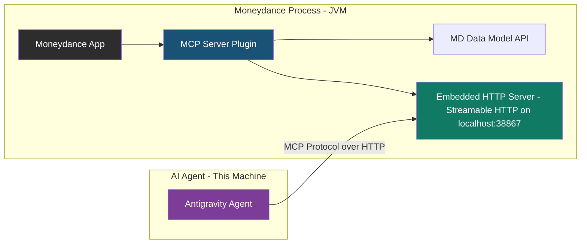

# Moneydance MCP Server Plugin

## 1. Approach Validation — Is This The Right Way?

### The Core Question
You want to expose Moneydance financial data to an AI agent. Let's honestly evaluate the options.

### Alternative Approaches Considered

| Approach | How It Works | Pros | Cons |
|:---|:---|:---|:---|
| **A. CSV/JSON Export → File MCP** | Export data from MD manually, point agent at files | Simple, no plugin needed | Stale data, manual export step, no live queries, no write-back |
| **B. Jython Script → File Dump** | Internal MD script exports to disk on schedule | Semi-automated | Still stale, no interactive queries, fragile scheduler |
| **C. JPype Headless Bridge** | External Python accesses MD's Java data model directly | No plugin needed | Unsupported, fragile, requires MD data file unlocked, encryption issues |
| **D. Plugin + Embedded HTTP/MCP Server** ✅ | MD plugin starts an MCP server on localhost | Live data, interactive queries, write-back possible, proper lifecycle | Requires Java plugin development, must manage server lifecycle |

### Verdict: **Option D is correct.** Here's why:

1. **Live data access.** Moneydance uses a proprietary, encrypted data format. The *only* stable, supported way to read it programmatically is through the internal Java API, which is only available to code running inside the Moneydance process (plugins or Jython scripts).

2. **Interactive queries.** MCP's tool-call model is a natural fit — the agent asks "what are my account balances?" and the plugin queries the live data model and responds. Export-based approaches cannot do this.

3. **The data never leaves your machine.** The MCP server binds to `127.0.0.1` only. Financial data flows over a local loopback socket. This is vastly more secure than any approach that writes data to disk files.

4. **Lifecycle management.** The plugin hooks into `md:file:opened` / `md:file:closing` events, so the server starts when a data file is open and stops cleanly when it closes.

> [!IMPORTANT]
> **No alternative approach gets close.** The export-based options (A, B) give you a stale snapshot with no interactivity. The headless bridge (C) is unsupported and can't handle encrypted data files. The plugin approach is the only one that gives you live, interactive, secure access to the canonical data source.

---

## 2. Architecture Overview



### Key Architectural Decisions

#### Transport: Streamable HTTP (not STDIO)

STDIO transport requires the MCP client to *spawn* the server as a child process. That's impossible here — the server must run inside the Moneydance JVM process, which is already running. **Streamable HTTP** is the correct transport:
- Plugin starts an HTTP server on `127.0.0.1:38867` (a high, uncommon port)
- Agent connects to `http://localhost:38867/mcp`
- No process management needed — the server lifecycle is tied to the plugin lifecycle

#### Language: Java (not Kotlin)

The open-source extensions use both Java and Kotlin. However:
- We want to minimise build complexity and dependencies for the hello world
- The MCP Java SDK has first-class Java support
- Kotlin adds Gradle Kotlin plugin versioning concerns (must match MD's 1.9)
- **We'll use Java 17** as recommended by the MD open-source repo

#### MCP SDK: `io.modelcontextprotocol.sdk:mcp` (core, no Spring)

- Latest version: `2.0.0-M2`
- We use the core SDK only — no Spring Boot, no framework overhead
- The SDK includes built-in Streamable HTTP transport support
- This keeps the plugin JAR small and avoids classloader conflicts inside MD

#### Build System: Gradle

- The moneydance_open repo uses Gradle
- We'll mirror that convention
- Produces a fat JAR that gets wrapped into an `.mxt` extension file

---

## 3. Security Model

> [!CAUTION]
> This plugin exposes your **personal financial data** via a local network socket. The following security measures are non-negotiable.

| Measure | Implementation |
|:---|:---|
| **Bind to localhost only** | `InetSocketAddress("127.0.0.1", 38867)` — unreachable from network |
| **Read-only by default** | Phase 1 tools are all read-only. Write tools require explicit future opt-in |
| **Origin validation** | Reject requests without matching `Origin` header (prevents DNS rebinding) |
| **No auth tokens in data** | MCP responses never include raw passwords or encryption keys |
| **Graceful shutdown** | Server shuts down on `md:file:closing` and `unload()` — no orphaned sockets |

---

## 4. Project Structure

```
md-mcp/
├── plugin/                              # The Moneydance extension (Java + Gradle)
│   ├── build.gradle                     # Build config, MD devkit deps, MCP SDK dep
│   ├── settings.gradle
│   ├── gradle.properties
│   ├── lib/                             # MD devkit JARs (extadmin.jar, moneydance-dev.jar)
│   │   ├── extadmin.jar                 # From devkit download
│   │   └── moneydance-dev.jar           # From devkit download
│   └── src/main/
│       ├── java/com/moneydance/modules/features/mcpserver/
│       │   ├── Main.java                # FeatureModule entry point — lifecycle
│       │   ├── McpServerManager.java    # Start/stop the embedded HTTP + MCP server
│       │   └── tools/
│       │       └── PingTool.java        # Hello-world tool: returns "pong" + MD version
│       └── resources/
│           └── meta_info.dict           # Extension metadata
│
├── client/                              # Standalone MCP client for testing (Node.js/TypeScript)
│   ├── package.json
│   ├── tsconfig.json
│   └── src/
│       └── test-client.ts              # Connects to localhost, calls ping tool, prints result
│
├── .gitignore
└── README.md
```

> [!NOTE]
> The `plugin/lib/` directory will contain the Moneydance devkit JARs (`extadmin.jar`, `moneydance-dev.jar`). These are proprietary and should NOT be committed to git. They must be downloaded from https://infinitekind.com/dev/moneydance-devkit-5.1.tar.gz

---

## 5. Hello World — What It Does

The skeleton proves the full stack works end-to-end:

1. **Plugin loads in Moneydance** → `Main.init()` is called
2. **On `md:file:opened` event** → `McpServerManager` starts an HTTP server on `127.0.0.1:38867`
3. **MCP server exposes one tool: `ping`** → Returns `{ "status": "pong", "moneydance_version": "2024.x", "data_file": "MyFinances" }`
4. **Test client (TypeScript)** → Connects to `http://localhost:38867/mcp`, discovers tools, calls `ping`, prints result
5. **On `md:file:closing` event** → Server shuts down gracefully

This proves:
- ✅ Plugin lifecycle works inside MD
- ✅ Embedded HTTP server can start/stop without breaking MD
- ✅ MCP protocol handshake works (initialize → list tools → call tool)
- ✅ Agent can connect and get a response
- ✅ Graceful shutdown doesn't leak resources

---

## 6. Phased Implementation Plan

### Phase 1: Project Scaffolding
- [ ] Download and extract the Moneydance devkit 5.1
- [ ] Initialize git repo in `md-mcp/`
- [ ] Create Gradle project structure for the plugin
- [ ] Create `build.gradle` with MD devkit and MCP SDK dependencies
- [ ] Create `meta_info.dict` extension metadata
- [ ] Create `.gitignore` (exclude `lib/*.jar`, `build/`, etc.)

### Phase 2: Plugin Skeleton (Java)
- [ ] Implement `Main.java` extending `FeatureModule`
  - `init()` — register event handler, log startup
  - `handleEvent()` — listen for `md:file:opened` / `md:file:closing`
  - `cleanup()` / `unload()` — delegate to server shutdown
- [ ] Implement `McpServerManager.java`
  - `start()` — create MCP server with Streamable HTTP transport on `127.0.0.1:38867`
  - `stop()` — graceful shutdown
  - Thread management — server runs off-EDT
- [ ] Implement `PingTool.java`
  - Registered as MCP tool `ping`
  - Returns JSON with status, MD version string, and current data file name

### Phase 3: Build & Install
- [ ] Configure Gradle to produce the `.mxt` file
- [ ] Create signing keys (self-signed for dev — force-load in MD)
- [ ] Install the `.mxt` into Moneydance
- [ ] Verify plugin loads (check MD console output)
- [ ] Verify HTTP server starts when data file opens

### Phase 4: Test Client (TypeScript/Node.js)
- [ ] Initialize Node.js project in `client/`
- [ ] Add `@modelcontextprotocol/sdk` dependency
- [ ] Implement `test-client.ts`:
  - Connect to `http://localhost:38867/mcp` using Streamable HTTP transport
  - Call `initialize`
  - Call `tools/list` — verify `ping` tool is discovered
  - Call `tools/call` with `ping` — print response
- [ ] Run test and verify full end-to-end flow

### Phase 5: Agent Configuration
- [ ] Add MCP server config to Antigravity settings (`.gemini/settings.json`)
- [ ] Verify Antigravity can discover and call the `ping` tool
- [ ] Document the setup process

---

## 7. Open Questions

> [!IMPORTANT]
> **Q1: Do you have the Moneydance devkit already?** I'll need you to download it from https://infinitekind.com/dev/moneydance-devkit-5.1.tar.gz and extract it. The JARs go into `plugin/lib/`.

> [!IMPORTANT]
> **Q2: What version of Moneydance are you running?** The devkit and API compatibility depends on this. The open-source repo targets `minbuild` 5064+.

> [!IMPORTANT]
> **Q3: Do you have a JDK 17+ installed?** We need it for compilation. If not, we'll need to install one first.

> [!IMPORTANT]
> **Q4: Port 38867** — I picked this arbitrarily (high, uncommon). Any preference or conflict? We could also make it configurable via MD preferences.

---

## 8. Verification Plan

### Automated Tests
- Plugin compilation: `gradle build` must succeed
- Client test: `npx tsx src/test-client.ts` must connect and receive a pong response

### Manual Verification
1. Open Moneydance with the plugin installed
2. Open a data file
3. Check MD console for "MCP server started on 127.0.0.1:38867"
4. Run the test client — should print the ping response
5. Close the data file in MD
6. Check MD console for "MCP server stopped"
7. Run the test client again — should fail to connect (confirming clean shutdown)
