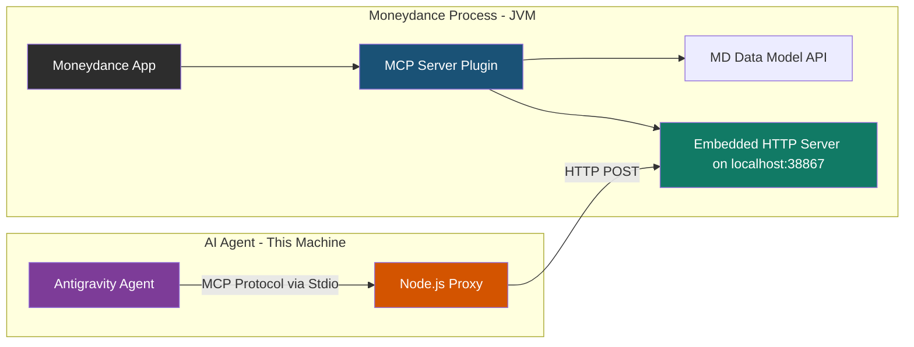

# Architecture Overview

This document describes the design decisions and architectural flow of the Moneydance MCP Server Plugin.

## Why a Plugin?

To expose Moneydance financial data to an AI agent, several approaches were considered:
- CSV/JSON Export (stale data, manual step)
- Jython Script (stale data, fragile scheduler)
- External Python Bridge (unsupported, requires unlocked files)

**The chosen approach is an embedded plugin.**
Moneydance uses a proprietary, encrypted data format. The *only* stable, supported way to read it programmatically is through the internal Java API, which is only available to code running inside the Moneydance process. A plugin allows for live data access, interactive queries, and the data never leaves the local machine.

## System Flow

## Key Architectural Decisions

### 1. Transport: Raw HTTP Sockets
The plugin implements a raw `java.net.ServerSocket` to handle HTTP POST requests. 
- **Why?** Moneydance bundles a highly stripped-down custom Java Runtime. Standard classes like `com.sun.net.httpserver.HttpServer` are often missing. By using raw sockets, the plugin achieves **zero external dependencies** and avoids any ClassNotFound exceptions in the Moneydance JVM.
- **Port:** The server binds exclusively to `127.0.0.1:38867`.

### 2. Protocol: JSON-RPC (Manual Parsing)
The plugin manually parses and formats the MCP JSON-RPC protocol strings.
- **Why?** To prevent ClassLoader conflicts with Moneydance's internal libraries, we avoid pulling in heavy dependencies like Jackson or Gson.

### 3. Client Integration: Node.js Proxy
AI Agents (like Antigravity or Claude Desktop) natively expect MCP servers to communicate via Standard I/O (`stdio`).
- **Why?** Because the Moneydance plugin runs inside a pre-existing GUI process, it cannot be spawned as a child process by the agent. 
- **Solution:** A tiny Node.js script (`client/src/mcp-proxy.mjs`) acts as the stdio MCP server for the agent, translating incoming requests into HTTP POST requests sent to the Moneydance plugin.

## Security Model

> [!CAUTION]
> This plugin exposes your personal financial data.

- **Localhost Only:** The server binds strictly to `127.0.0.1`. It is unreachable from the local network.
- **Read-Only:** The implementation is strictly read-only.
- **Lifecycle Tied to Data File:** The server only starts when a Moneydance data file is unlocked and opened (`md:file:opened`), and shuts down immediately when the file is closed (`md:file:closing`).
